  

# George Salib 🌌

I am an insatiable learner and developer focused on the intersection of **computational science and software engineering**. My background combines building complex technical frameworks with leading large-scale community initiatives.

---

### 🚀 Focus & Expertise

- **Computational Physics:** Built a Lagrangian-based Newtonian **N-body simulation framework** to simulate Newtonian multi-star systems using Python.
- **Machine Learning:** Developed a **Celestial Classifier** using Random Forest on SDSS DR17 data, achieving a **0.98 weighted F1-score**.
- **Systems & Networking:** Implemented a multithreaded **HTTP Web Server** from scratch using Python's socket library.
- **Cybersecurity:** Experienced mentor and practitioner with skills in **Wireshark, Nmap, and Burp Suite**.

### 🛠️ Technical Toolkit

- **Languages:** Python (Proficient), C++ (Competent), Bash, MySQL, LaTeX.
- **Tech:** Linux (Ubuntu, Mint, RPiOS, Kali), Git, VirtualBox, Blender.
- **Hardware:** Raspberry Pi, Arduino, EasyEDA.

### 🌍 Impact & Leadership

- **Hackathon Leadership:** Lead Organizer for [**Scrapyard Giza**](https://stemeghackclub.org/Hackathons/scrapyard) and [**Counterspell Giza**](https://stemeghackclub.org/Hackathons/counterspell) (total 250+ attendees).
- **Community Growth:** Raised **$3,500+** in funding and supported over 1,000 students through technical mentoring & leadership.
- **Mentorship:** Served as **Vice President** & **Cybersecurity Mentor** of the [STEM Egypt Hack Club](https://stemegypt.hackclub.com).

### ⚡ Currently Tinkering With

- Wokring on the next major [Hack Club event](https://horizons.hackclub.com/equinox) for the community
- Designing an OAuth 2.0 Provider using Flask

---

### 📝 Latest from My Blog

<!-- BLOG-POST-LIST:START -->
<!-- BLOG-POST-LIST:END -->

### 📊 GitHub Activity

---

  
  &emsp;
  
  &emsp;
  
  
  > _Ad Astra per Aspera_ 🌌

